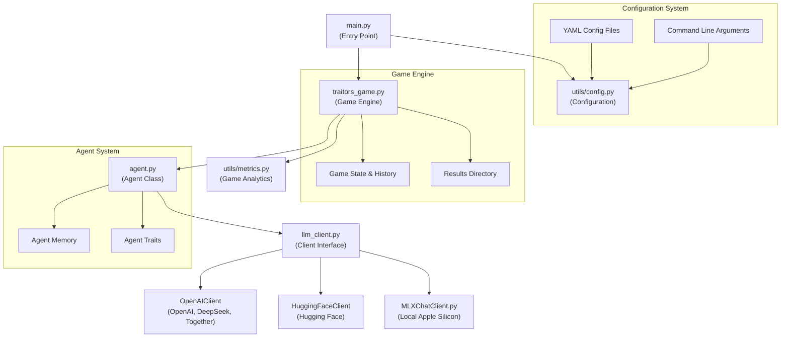
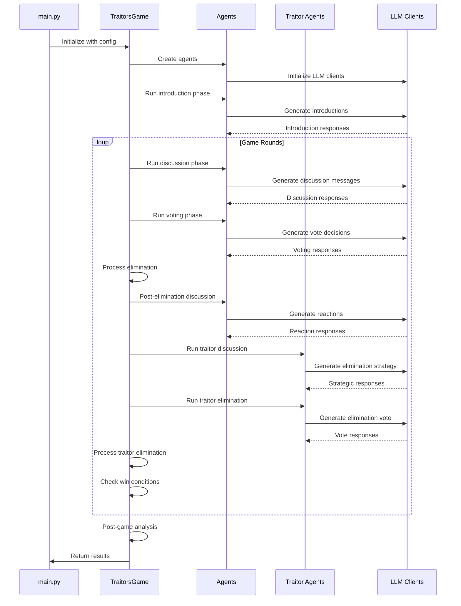
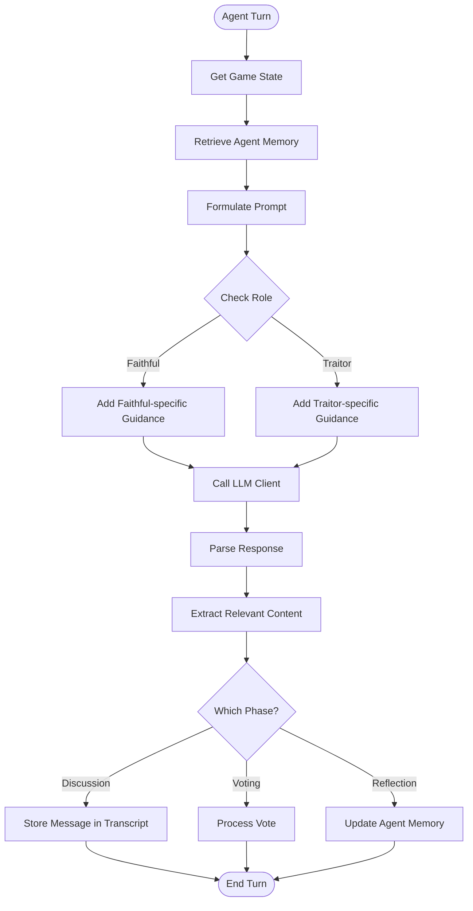
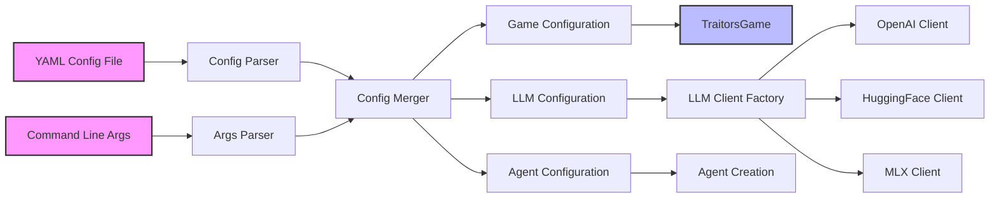
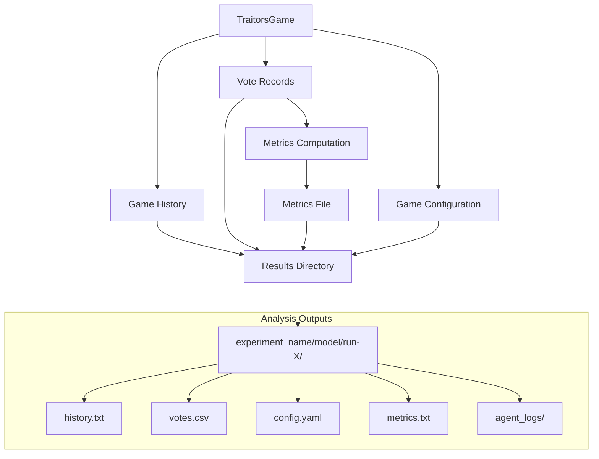

# TheTraitors Codebase Architecture Diagrams

This document contains Mermaid diagrams visualizing the architecture and flow of the TheTraitors framework.

## Component Relationships

## Game Flow Sequence

## Agent Decision Making

## Configuration System

## Results and Analytics Flow

